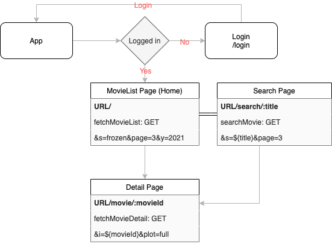

# 🎥 영화 검색 프로젝트 (Vue.js, OMDb API 활용)

# 🔗 [프로젝트 링크](https://moviejonghyeon.netlify.com)
[](https://app.netlify.com/sites/nostalgic-davinci-958000/deploys)


## 1. 검색


## 2. 새로고침시 자동 추천어 검색


## 3. 마우스 클릭&드래그 / 터치 둘다 되는 슬라이드


## 4. 반응형


- 과제 기간: 10/5 - 10/08
- 리뷰 기간: 10/11 - 10/16



### 기본 요구사항

- [x] 검색어 입력 -> 영화 검색
- [x] 검색 결과통해 영화 상세정보 제공
- [x] 클라이언트에 API Key(`7035c60c`) 노출 방지
- [x] 실제 서비스 배포, 링크 추가

## API 사용법

- 참고 사이트: [The Open Movie Database](http://www.omdbapi.com/)
- 요청 주소: `https://www.omdbapi.com`
- Method: `GET`
- API_KEY: `7035c60c`

### 영화 목록 검색

| 파라미터 | 필수 | 설명             | 기본값 | 유효 값   |
| -------- | ---- | ---------------- | ------ | --------- |
| `s`      | 예   | 검색할 영화 제목 |        |
| `y`      |      | 영화 출시 년도   |        |
| `page`   |      | 검색 결과 페이지 | `1`    | `1`~`100` |

요청 예시:

```url
https://www.omdbapi.com?apikey=7035c60c&s=frozen&page=3
```

응답 예시:

- `Search`: 영화 목록, 1페이지(`page`) 당 최대 10개
- `totalResults`: 검색 가능한 모든 영화 개수

```json
{
  "Search": [
    {
      "Title": "Frozen",
      "Year": "2013",
      "imdbID": "tt2294629",
      "Type": "movie",
      "Poster": "https://m.media-amazon.com/images/M/MV5BMjA0YjYy...eQXVyNDg4NjY5OTQ@._V1_SX300.jpg"
    },
    "...최대10개"
  ],
  "totalResults": "263",
  "Response": "True"
}
```

### 영화 상세 검색

| 파라미터 | 필수 | 설명                         | 기본값  | 유효 값 |
| -------- | ---- | ---------------------------- | ------- | ------- |
| `i`      | 예   | 검색할 영화 아이디(`imdbID`) |         |
| `plot`   |      | 영화 줄거리 길이             | `short` | `full`  |

요청 예시:

```url
https://www.omdbapi.com?apikey=7035c60c&i=tt4520988&plot=full
```

응답 예시:

```json
{
  "Title": "Frozen II",
  "Year": "2019",
  "Rated": "PG",
  "Released": "22 Nov 2019",
  "Runtime": "103 min",
  "Genre": "Animation, Adventure, Comedy",
  "Director": "Chris Buck, Jennifer Lee",
  "Writer": "Jennifer Lee, Hans Christian Andersen, Chris Buck",
  "Actors": "Kristen Bell, Idina Menzel, Josh Gad",
  "Plot": "Having harnessed her ever-growing power after lifting the dreadful curse of the eternal winter in Frozen (2013),",
  "Language": "English",
  "Country": "United States",
  "Awards": "Nominated for 1 Oscar. 17 wins & 90 nominations total",
  "Poster": "https://m.media-amazon.com/images/M/MV5BMjA0YjYy...eQXVyNDg4NjY5OTQ@._V1_SX300.jpg",
  "Ratings": [
    {
      "Source": "Internet Movie Database",
      "Value": "6.8/10"
    },
    {
      "Source": "Rotten Tomatoes",
      "Value": "77%"
    },
    {
      "Source": "Metacritic",
      "Value": "64/100"
    }
  ],
  "Metascore": "64",
  "imdbRating": "6.8",
  "imdbVotes": "151,940",
  "imdbID": "tt4520988",
  "Type": "movie",
  "DVD": "22 Nov 2019",
  "BoxOffice": "$477,373,578",
  "Production": "Walt Disney Animation, Walt Disney Pictures",
  "Website": "N/A",
  "Response": "True"
}
```
